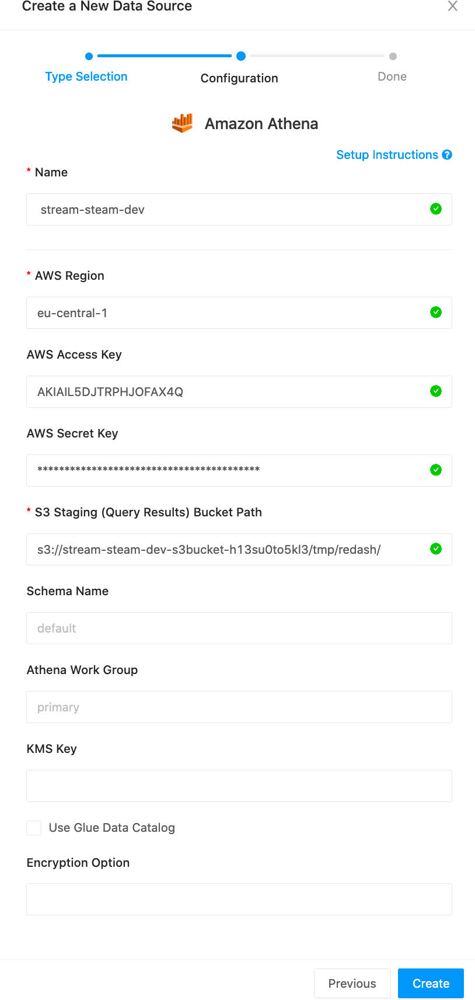

=======
Modules
=======

Overview
========

Modules provide the possibility to extend StreamSteam.
Two modules are currently shipped with StreamSteam. Own modules can be created.

* List all available modules

.. code-block:: bash

    ./stream-steam module list

* Enable a module

.. code-block:: bash

    ./stream-steam module enable --name module-name

* Show module howto

.. code-block:: bash

    ./stream-steam module howto --name module-name

* Disable a Module

.. code-block:: bash

    ./stream-steam module disable --name module-name

Redash EC2 Instance
===================

Dashboards for your data

1. Enable and deploy the module

.. code-block:: bash

    ./stream-steam module enable --name redash

After a successful deployment it can take up to 5 minutes for the Redash web server to be available.

2. Initial Setup

* Start the howto module command and open the URL that is shown below the section `connect via HTTP to redash`

.. code-block:: bash

    ./stream-steam module howto --name redash

* Create a Redash admin user

    Example how to create an admin user

3. Connect a Data Source

Choose ``Amazon Athena``, you can find the necessary settings in the `setup redash` section of the howto output.

    Example how to connect to your datalake

4. Create a Query

.. code-block:: sql

    SELECT COUNT(*) AS count,
           geo_info.country,
           geo_info.city,
           device_info.device.type,
           device_info.device.name
    FROM stream_steam_dev.events_enriched
    GROUP BY geo_info.country,
             geo_info.city,
             device_info.device.type,
             device_info.device.name
    ORDER BY count DESC

    Example Query

5. Build a Dashboard

`Redash Documentation <https://redash.io/help/user-guide/dashboards/dashboard-editing>`_

6. Disable the module

.. code-block:: bash

    ./stream-steam module disable --name redash

EMR Spark Cluster
=================

A Spark Cluster for your data

.. image:: _static/modules/emr-spark-cluster/teaser.png
    :width: 800px

1. Enable and deploy the module

.. code-block:: bash

    ./stream-steam module enable --name emr-spark-cluster

2. Use the Spark cluster

* Start the howto module command and follow the instructions below the section `How to connect to the cluster`

.. code-block:: bash

    ./stream-steam module howto --name emr-spark-cluster

3. Disable the module

.. code-block:: bash

    ./stream-steam module disable --name emr-spark-cluster
